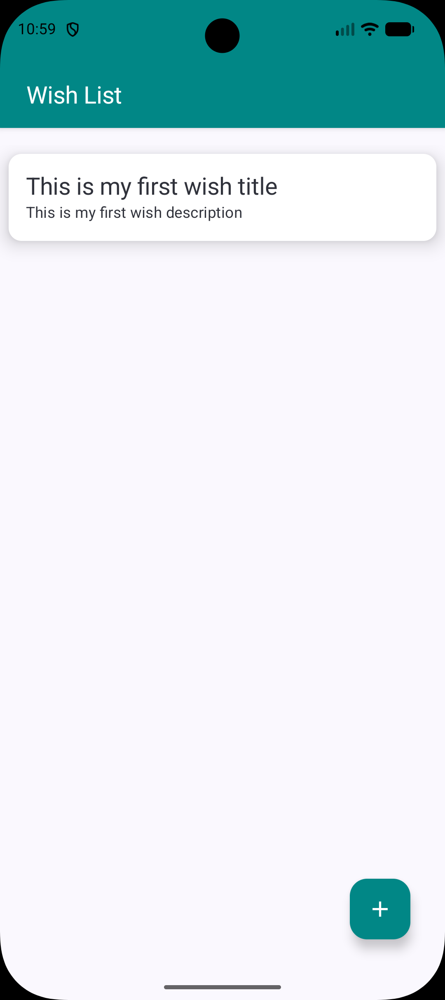
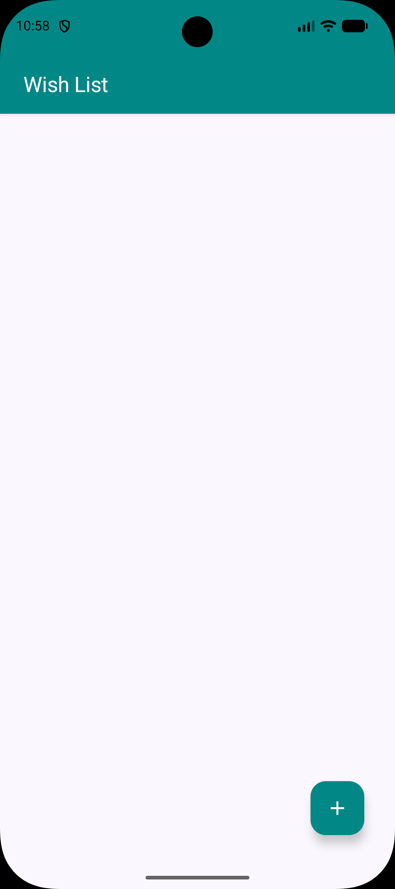
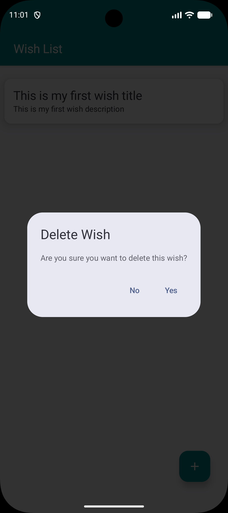

# WishList App (Room DB)

A modern Android application built using **Jetpack Compose** and **Room Database** to manage a personal wish list. The app follows modern Android development practices, including MVVM architecture and clean code principles.

## Features

- **Add Wishes**: Create new wishes with a title and description.
- **Update Wishes**: Edit existing wishes by swiping left-to-right or clicking on the item.
- **Delete Wishes**: Remove wishes by swiping right-to-left.
- **Confirmation Dialog**: Safety feature to confirm deletion before removing a wish.
- **Local Persistence**: Data is stored locally using Room Database, ensuring it's available offline.
- **Modern UI**: Built entirely with Jetpack Compose and Material 3.

## Tech Stack

- **Kotlin**: Primary programming language.
- **Jetpack Compose**: Declarative UI toolkit.
- **Room Database**: SQLite abstraction layer for local data storage.
- **KSP (Kotlin Symbol Processing)**: For faster annotation processing.
- **Navigation Compose**: Type-safe navigation between screens.
- **Coroutines & Flow**: For asynchronous programming and reactive data streams.

## Screenshots

| Home Screen | Add/Edit Screen | Delete Confirmation |
| :---: | :---: | :---: |
|  |  |  |

*(Note: Create a `screenshots` folder and add your PNG files there to display them in this README)*

## How to Run

1. Clone the repository.
2. Open the project in **Android Studio (Ladybug or newer)**.
3. Ensure you have the **Android SDK 35/37** installed.
4. Build and run the app on an emulator or physical device.

## License

```text
MIT License
```
